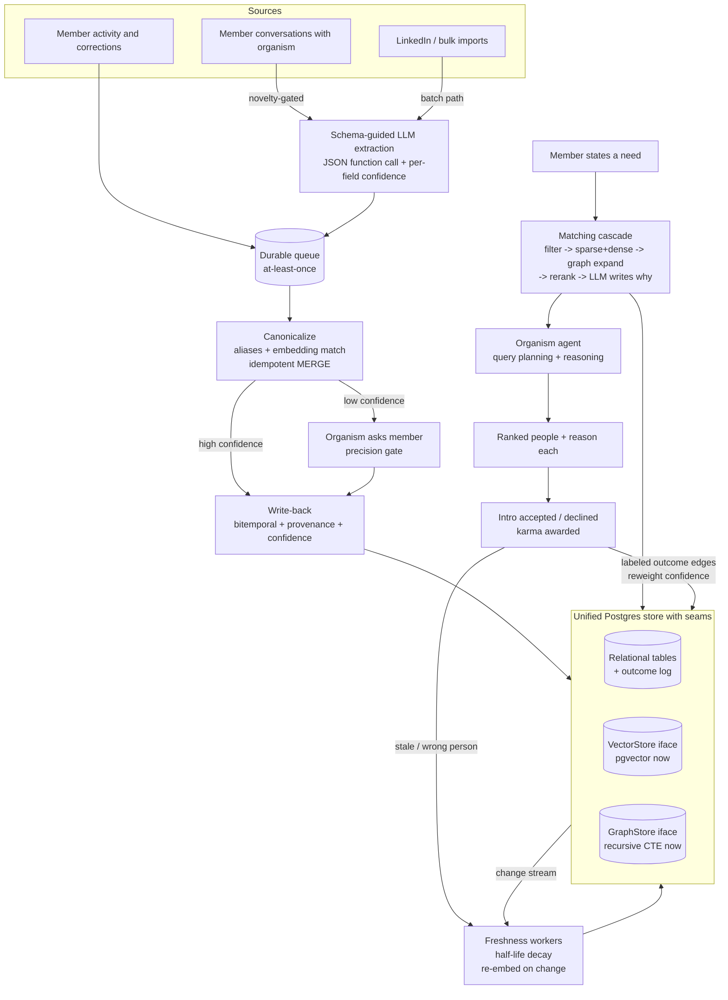

# Ambit Backend Architecture

Decision doc for the people / skills / needs knowledge graph that powers Ambit. It is written to optimize for **both** ends at once: maximum match quality and trust at today's scale (thousands of members, little outcome data), and a clean path to millions of members and hundreds of millions of edges with no rewrite.

It supersedes the first synthesis and is built on the four research briefs in `docs/research/` (data model, ingestion, freshness, retrieval).

Author: principal engineering synthesis, revised 2026-06-26.

---

## 1. Executive summary

- **The two goals are not a tradeoff if you split two layers.** Design the **schema and module interfaces** at the million-scale, graph-native, temporal shape from day one. Back each interface with the **simplest implementation** that maximizes quality at current scale. Every heavy component is swappable behind a stable interface, so scaling is a config change, not a migration. You pay a small design tax now to avoid a large rewrite tax later, while running the quality-optimal system today.
- **Frame the whole backend as an agent-native temporal knowledge graph** (the Graphiti / Zep pattern), not an ETL-into-a-database pipeline. The "living organism" agent reads and writes the graph as its evolving memory. This frame is simultaneously the quality-optimal design for the agent now and the scalable substrate later, so it is the architecture that serves both.
- **One unified Postgres store, with seams.** Postgres 16+ holds relational tables, vectors (pgvector/HNSW), and a graph-shaped edge model. Graph traversal and vector search each sit behind a thin interface so the engine can be swapped (AGE/Neo4j, Qdrant/Milvus) when metrics demand, without touching the product or the schema.
- **One matching cascade serves both scales.** filter -> retrieve (sparse + dense) -> graph expand -> rerank -> LLM writes the "why". At small scale the funnel is shallow and the LLM reasons over many candidates (quality-max). At large scale the funnel pre-filters harder and the LLM does less (cost-control). Same code path; you tune where the work happens.
- **Design-in from day one (cheap, serves both):** typed / reified / bitemporal / confidence-weighted edges; asymmetric need-vector vs offer-vector embeddings; model + version metadata on every vector; provenance and valid-time on every fact; and outcome logging (every accepted / declined intro and karma event) as labeled edges.
- **Implement now (quality-max, small scale):** hosted embedding model, LLM-heavy reasoning in the cascade, Postgres recursive CTEs for 1-2 hop graph, member-confirmation precision gate, half-life decay for trust.
- **Swap in later, gated on measured metrics (not preemptively):** AGE/Neo4j graph engine, dedicated vector DB, Splink entity resolution, Debezium CDC, ESCO canonical linking, distilled/fine-tuned rankers and GNNs.
- **The one real tradeoff (LLM quality vs cost) is solved over time by design:** because outcomes are logged from day one and the embedder/ranker are swappable, you can later distill the LLM's matching judgments into cheaper models that preserve quality at a fraction of the cost. That path only exists if the seams are in from the start.

---

## 2. The dual-optimization principle

Separate **interface and schema** (build at the target shape now, it is cheap) from **implementation** (run the quality-max minimal version now, swap later). This is the spine of the whole document.

| Concern | Design in NOW (forward-compatible) | Implement NOW (quality-max at small scale) | Swap in LATER (no schema change) | Trigger to swap |
|---|---|---|---|---|
| Graph | Typed, reified, bitemporal, confidence-weighted edge schema; `GraphStore` interface (`neighbors`, `pathsBetween`, `expand`) | Postgres recursive CTEs over the edge table | Apache AGE, then Neo4j / NebulaGraph behind the same interface | 1-2 hop latency degrades, or 3+ hop matching needed, or active edges > ~10^8 |
| Vectors | `VectorStore` interface; vectors carry model + version + dim metadata; separate need and offer vectors | pgvector with HNSW | Qdrant (best filtering) or Milvus (billion-scale), re-embed offline | filtered-query p99 degrades, or > ~10-50M vectors |
| Embeddings | Pluggable `Embedder`; every vector tagged with its model version so re-embed is safe | Hosted model (text-embedding-3-small or Cohere), asymmetric need/offer | Fine-tuned or distilled embeddings trained on logged outcomes | match quality plateaus and outcome data is rich |
| Matching | One cascade pipeline with pluggable stages; structured query object from the agent | Shallow funnel: LLM reasons over many candidates | Deeper funnel: ANN pre-filter to ~50, cross-encoder rerank, LLM only writes "why" | candidate sets grow / LLM cost per query crosses budget |
| Taxonomy | Free text + embeddings are primary; optional `canonical_concept_id` FK on attributes | None; embeddings carry the nuance of fuzzy offers/needs | ESCO (+ O*NET crosswalk) linked via async job for structured filtering and interop | structured filtering / reporting / interop becomes needed |
| Identity / ER | Provenance, source, confidence on every belief; stable member identity keys | Dedup-at-write (canonical aliases, uniqueness constraints) | Splink probabilistic ER + Zingg active learning as async jobs | external-source ingestion or duplicate rate rises |
| Freshness | valid_from / valid_to / observed / recorded on fact edges; decay parameters in schema | Per-attribute half-life decay + re-verification prompts | Debezium CDC for incremental re-embed / re-resolve | nightly recompute stops fitting the window |
| Learning | Outcome edges (accepted/declined/karma) logged from day one | Heuristic + LLM ranking | Link prediction, two-tower, GraphSAGE trained on outcomes | meaningful accepted/declined volume accumulates |

Rule of thumb: anything in the first two columns is cheap and lands now. Anything in the fourth column is real but deferred until its trigger fires. Standing up the whole stack on day one would create operational drag that slows the iteration that earns good matches, which would hurt the product. "Both" means the seams are million-ready; the running system stays minimal until metrics pull each piece in.

---

## 3. Recommended architecture

### Frame: an agent-native temporal knowledge graph

The organism agent is the primary reader and writer of the graph. Facts enter as it converses, are stored with time and provenance, decay or get invalidated as reality drifts, and are retrieved by the same agent to answer needs. This is the Graphiti / Zep temporal-KG-for-agents pattern, chosen because it is both the quality-optimal design for the agent now and the scalable substrate later.

### Store: unified Postgres, with swappable seams

Postgres 16+ running three co-located capabilities, each reached through an interface so its engine can be replaced:

- **Relational tables**: member identity, attributes, asks, connections, karma, provenance, outcome log.
- **pgvector (HNSW)**: dense ANN over separate need and offer vectors, behind a `VectorStore` interface.
- **Graph-shaped edge model**: typed, reified, bitemporal, confidence-weighted edges, behind a `GraphStore` interface (recursive CTEs now; AGE/Neo4j later).

Around it: an extraction service, a canonicalization layer, the matching cascade, and the organism agent. The same change stream (recursive triggers now, Debezium later) drives incremental re-embedding and freshness.

### Component diagram and data flow

### The feedback loop

The shortlist returns reasons; the member accepts or declines; helping earns karma. An accepted, karma-rewarded connection reinforces the offer/need/skill edges that produced it; a declined match decays them; "no longer relevant" expires a need; "wrong person" feeds the (later) active-learning ER queue. Every labeled outcome accumulates as training data for the distilled rankers that later give you quality at low cost. The loop is the moat and the bridge between the two goals.

---

## 4. The matching cascade (the crux of optimizing for both)

One pipeline, identical at every scale; only the funnel depth changes.

1. **Plan.** The organism turns the natural-language need into a query embedding plus structured filters (industry, availability, location) via self-query planning.
2. **Retrieve.** Sparse (BM25, for rare exact terms like "Rust" or "FDA 510(k)") plus dense (pgvector HNSW, for paraphrase) against the **offer** vectors, fused with Reciprocal Rank Fusion.
3. **Expand.** `GraphStore.expand` from the seed nodes for trust paths (shared connections, prior successful intros), with strict depth and fanout limits.
4. **Rerank.** Cross-encoder on the top candidates.
5. **Explain.** The LLM writes the human-readable "why" for the final shortlist only.

How the same cascade serves both:
- **Today (thousands, sparse data):** retrieval returns a small candidate set, so the funnel is shallow and the LLM reasons richly over many candidates. This is the quality-max regime and it directly counters cold start.
- **At millions:** ANN pre-filters hard, the cross-encoder culls to ~50, and the LLM only writes the "why". Cost stays bounded.
- **Over time:** outcomes train a distilled ranker and fine-tuned embeddings that move quality earlier in the funnel, so you keep quality while cutting LLM spend. This is the concrete answer to the one real tradeoff.

Asymmetry matters: embed needs and offers as separate vectors so a need matches an *offer*, not a similar-sounding need. This is the highest-leverage modeling decision and it is scale-independent.

---

## 5. Per-area deep dive

### 5a. Data model and ontology

Labeled-property-graph shape, stored relationally now. Member data stays in the property-graph model (typed nodes for members, skills, industries, roles, interests; typed edges for has_skill, offers, needs, connected, earned_karma). Reserve RDF/OWL strictly for the skill ontology layer (ESCO concept hierarchy) if and when it is linked; never put member data in triples (an order of magnitude of overhead and weaker traversal).

Design in now: every fact edge is **reified, weighted, confidence-scored, and bitemporal** (valid_from/valid_to separate from observed/recorded), and you **invalidate rather than delete** superseded facts. This single schema choice is what makes trust (5c), graph traversal (5d), and audit all work, and it is cheap to add now and expensive to retrofit. Match around supernodes ("JavaScript", "Tech") by going through the vector index first and verifying on the graph, never by traversing hub nodes.

### 5b. Ingestion and extraction

A thin custom pipeline, not a heavy framework. Schema-guided extraction (LLM with a strict JSON function call) emits typed skills/experiences/industries/interests/offers/needs with per-field confidence. Two-speed: a durable queue feeds a streaming consumer that canonicalizes-then-MERGEs for live updates, plus a batch path for LinkedIn imports and nightly re-extraction. At-least-once delivery plus idempotent writes (uniqueness constraints so MERGE is an index lookup). High-confidence fields auto-write; low-confidence fields are surfaced to the member through the organism, which is the cheapest high-precision validator and doubles as engagement. Cost control: novelty-gate extraction (do not re-run the LLM when nothing new was said) and use the provider Batch API for non-urgent work.

### 5c. Freshness and accuracy

Trust is existential for a networking product. Design in now: provenance and valid-time on every belief, plus per-attribute **half-life decay** (needs expire in weeks, current role in months, credentials persist), with re-verification prompts before a stale fact causes a bad match. Dedup-at-write via canonical aliases handles the common case now. Defer the heavy entity-resolution machinery (embedding blocker -> Splink probabilistic matching -> LLM reranker on ambiguous pairs, with Zingg active learning from "wrong person" corrections) until external-source ingestion or duplicate rate justifies it, and require confidence thresholds plus human review for merges since false merges are hard to reverse. Incremental maintenance moves from triggers to Debezium CDC when nightly recompute stops fitting.

### 5d. Retrieval and matching

Covered as the cascade in Section 4. Engine choices sit behind the `VectorStore` and `GraphStore` interfaces: pgvector + recursive CTE now; Qdrant/Milvus and AGE/Neo4j later on their triggers. Defer GNNs (GraphSAGE, two-tower) until outcome data exists; when adopted, prefer inductive methods for cold start and add diversity constraints because outcome-trained ranking over-favors already-popular nodes.

---

## 6. Tech stack

| Component | Now | Later | Trigger |
|---|---|---|---|
| Primary store | Postgres 16+ | same | n/a |
| Vector index | pgvector (HNSW) behind `VectorStore` | Qdrant or Milvus | > ~10-50M vectors or filtered p99 degrades |
| Graph | Postgres recursive CTE behind `GraphStore` | Apache AGE, then Neo4j / NebulaGraph | 3+ hop matching or active edges > ~10^8 |
| Embeddings | text-embedding-3-small or Cohere; separate need/offer | distilled / fine-tuned on outcomes | quality plateaus with rich outcome data |
| Sparse retrieval | Postgres FTS (BM25) | dedicated hybrid engine | at vector-DB migration |
| Reranker | BGE-reranker-v2 (self-host) or Cohere Rerank | LLM rerank for nuance-critical slices only | rarely |
| Extraction + reasoning LLM | DeepSeek (OpenAI-compatible), JSON function call | provider-agnostic via the function-call contract | cost or quality |
| Ingestion queue | managed (SQS / Redis-backed) | Kafka | ~10^5+ msgs/sec or replay needs |
| Entity resolution | dedup-at-write (aliases + constraints) | Splink + Zingg active learning | external sources / duplicate rate |
| CDC | Postgres triggers | Debezium | recompute window exceeded |
| Ontology | free text + embeddings; optional canonical FK | ESCO + O*NET crosswalk async linker | structured filtering / interop |
| Graph learning | heuristic + LLM ranking; log outcomes | link prediction, two-tower, GraphSAGE | outcome volume |

---

## 7. Migration path (forward-compatible foundations first)

Each phase ships a working system. The reordering front-loads the cheap design-in-now choices so nothing later requires a rewrite.

### Phase 0: Postgres with seams, behavior unchanged
Port the SQLite schema to Postgres 16+; install pgvector; put graph access and vector access behind `GraphStore` and `VectorStore` interfaces (recursive CTE and pgvector implementations). Keep current behavior identical. Unlocks the unified store and the seams everything else depends on.

### Phase 1: Forward-compatible schema + outcome logging
Remodel offers/needs/connections/karma as typed, reified, bitemporal, confidence-weighted edges. Start logging every accepted/declined intro and karma event as labeled outcome edges. This is cheap, changes little behavior, and is the bridge to every future capability (trust, graph, learning). Do this before adding features so they all land on the right shape.

### Phase 2: Real embeddings and the cascade
Replace homegrown TF-IDF/random-projection with a hosted model; embed needs and offers as separate vectors into pgvector; stand up the full cascade (sparse + dense -> RRF -> graph expand via CTE -> cross-encoder rerank -> LLM "why"). This is the match-quality leap and it works at today's scale immediately.

### Phase 3: Trust: freshness and the precision gate
Add half-life decay with re-verification, provenance-aware conflict handling, and the member-confirmation precision gate in the organism. The graph now stays true as reality drifts.

### Phase 4: Schema-guided ingestion at quality
Replace ad hoc writes with the two-speed pipeline: durable queue, JSON-function-call extraction with confidence, canonicalize-then-MERGE, novelty gating, Batch API for imports. Optional ESCO linker as an async job.

### Phase 5: Scale-out, only when triggers fire
Apply the Section 6 triggers as they actually bite: swap pgvector for Qdrant/Milvus, recursive CTE for AGE/Neo4j, triggers for Debezium, add Splink ER, train GraphSAGE/two-tower on accumulated outcomes. None preemptively.

---

## 8. Risks and open questions

- **LLM quality vs cost vs latency** is the one unavoidable tradeoff. The cascade plus outcome-logging-then-distillation is the plan, but distillation needs data to accumulate, so cost relief at scale lags. Instrument cost per query from Phase 2.
- **Decay half-life calibration** is a hypothesis; wrong values expire live needs or keep stale ones. Learn the half-lives from observed fact churn rather than hard-coding.
- **Apache AGE maturity** is the weakest engine bet; the `GraphStore` interface exists precisely so AGE is optional and replaceable by Neo4j without product change.
- **Auto-merge errors erode trust**; keep ER behind confidence thresholds and human review.
- **Popularity bias** in outcome-trained ranking needs an explicit diversity objective before any GNN ships.
- **Single-provider (DeepSeek) dependency** across extraction, reranking, and reasoning; the function-call contract is the abstraction boundary, keep it provider-agnostic.
- **Cold start** for brand-new members with no edges needs a deliberate content-only fallback until the graph fills in.
- **Threshold accuracy**: the swap triggers are research estimates, not measured on Ambit's workload. Instrument vector count, active edge count, traversal depth, and filtered p99 from Phase 0 so every split is data-driven.

---

## 9. Sources

Per-area citations (about 70 sources total) live in the four research briefs:
- `docs/research/01-data-model.md`
- `docs/research/02-ingestion.md`
- `docs/research/03-freshness.md`
- `docs/research/04-retrieval.md`

Key anchors: the Graphiti / Zep temporal knowledge graph pattern (https://www.getzep.com/ai-agents/temporal-knowledge-graph/), LinkedIn's knowledge graph (https://www.linkedin.com/blog/engineering/knowledge/building-the-linkedin-knowledge-graph), ESCO (https://data.europa.eu/esco/model), Splink (https://moj-analytical-services.github.io/splink/index.html), hybrid graph + vector retrieval (https://medium.com/graph-praxis/hybrid-vector-graph-retrieval-patterns-11fdbd800e3e), and pgvector vs dedicated vector stores (https://tensorblue.com/blog/vector-database-comparison-pinecone-weaviate-qdrant-milvus-2025).
